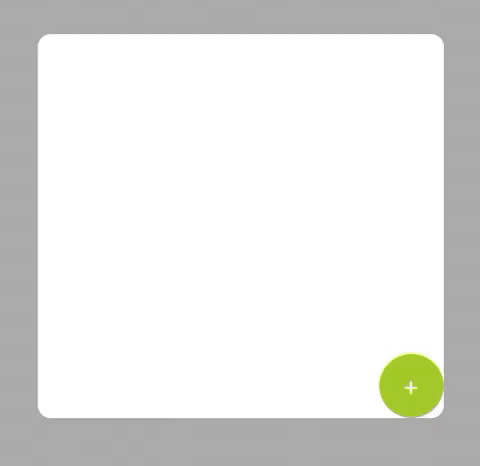

# HidableStepper
A simple stepper that can hide part of itself 

#### Version 1.x
- **January, 2020** - HidableStepper 🥳

## Usage

The component will automatically hide everything but the plus button when the `quantityOfItems` is equals to `minimumNumberOfItems`, this value by default is 0.

You can fully customize the buttons setting the properties on `additionButton` and `decreaseButton` or setting one of pre set types of the component:

- .normal

- .fullyRounded

- .bottomRounded

- .circular

To control the component's behavior sign to its delegate (`HidableStepperDelegate`)

## Bugs and Feedback
For bugs, questions and discussions please use the [Github Issues](https://github.com/chrsp/HidableStepper/issues).
