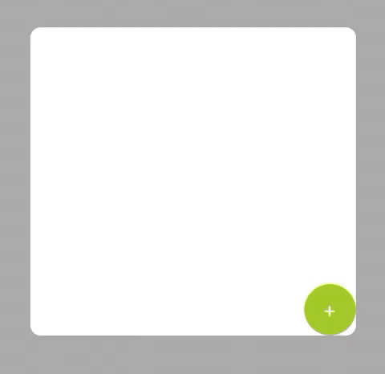

# HidableStepper
A simple stepper that can hide part of itself 



#### Version 0.0.1
- **January, 2020** - HidableStepper 🥳

## Installation
###  CocoaPods

```ruby
pod 'HidableStepper''
```

###  Manually
You can directly copy and paste the folder `HidableStepper` to your project.

## Usage

The component will automatically hide everything but the plus button when the `quantityOfItems` is equals to `minimumNumberOfItems`, this value by default is 0.

You can fully customize the buttons setting the properties on `additionButton` and `decreaseButton` or setting one of pre set types of the component:

- .normal


- .fullyRounded


- .bottomRounded


- .circular


To control the component's behavior sign to its delegate (`HidableStepperDelegate`)

## Bugs and Feedback
For bugs, questions and discussions please use the [Github Issues](https://github.com/chrsp/HidableStepper/issues).
